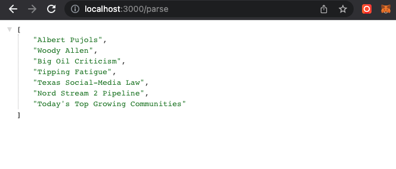
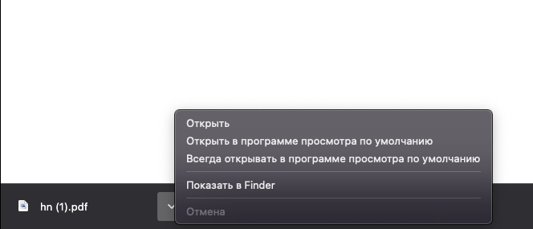

# Web-Scraper-Nodejs

Web application on node js. ! [GitHub actions settings](./img/first.png)

1. Web site Parsing, the site can be dynamic (written in JS). There are two inputs: the first is a
   link to a web page, the second is to enter an attribute or class that we want to find information
   on the site (parsing). When submitting, we get a json file with an array of strings.
   
2. Saving the web page in PDF format. Specify the link to the web page and click save. And a pdf
   file is sent to us. 
